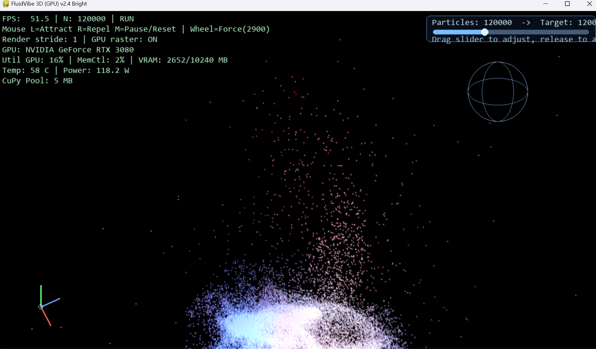
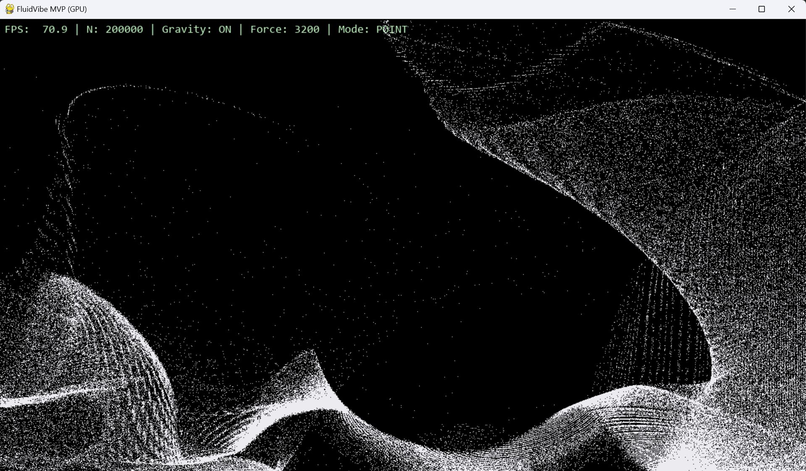

# FluidVibe

基于 Python + CUDA 的实时粒子流体实验项目，包含：

- 本地高性能 3D 程序（推荐主体验）
- FastAPI + WebSocket 预览服务（用于轻量交互和联调）

## 实验原理文档

- [技术实现原理](docs/TECHNICAL_PRINCIPLES.md)

## 项目特性

- GPU 物理计算（`CuPy`）
- 实时鼠标交互（吸引/排斥/冲击）
- 可调粒子数量（内置滑块）
- 实时性能监控（FPS/GPU/显存）
- Web 预览端（非核心渲染入口）

## 效果截图





## 目录结构

```text
.
├── fluid_sim.py                 # 2D 本地粒子程序
├── fluid_sim_3d.py              # 3D 本地主程序（推荐）
├── app.py                       # FastAPI 服务（含 ws/sim 与 ws/sim3d）
├── web/                         # Web 预览前端
├── requirements.txt
└── docs/
    └── TECHNICAL_PRINCIPLES.md  # 技术实现原理
```

## 环境依赖

建议 Python 3.10+，NVIDIA 显卡（CUDA 11.x/12.x）。

安装依赖：

```bash
pip install -r requirements.txt
```

## 运行方式

### 1) 本地 3D（推荐）

```bash
python fluid_sim_3d.py --particles 120000 --width 1280 --height 720
```

### 2) 本地 2D

```bash
python fluid_sim.py
```

### 3) Web 预览服务

```bash
python app.py
```

浏览器访问：

- `http://127.0.0.1:8000/web/`（默认 2D 预览）
- `http://127.0.0.1:8000/web/index.html?mode=3d`（3D 预览）

## 本地 3D 交互说明

- 左键按住：吸引粒子
- 右键按住：排斥粒子
- 中键单击：暂停/继续
- 中键双击：重置
- 滚轮：调节鼠标力强度
- 顶部滑块：调整粒子数量（松开后生效）

## 注意事项

- Web 版本定位为预览，不建议作为最终性能体验入口。
- 若 `CuPy` 不可用，Web 服务会自动回退到 CPU 模式（可运行但性能较低）。

